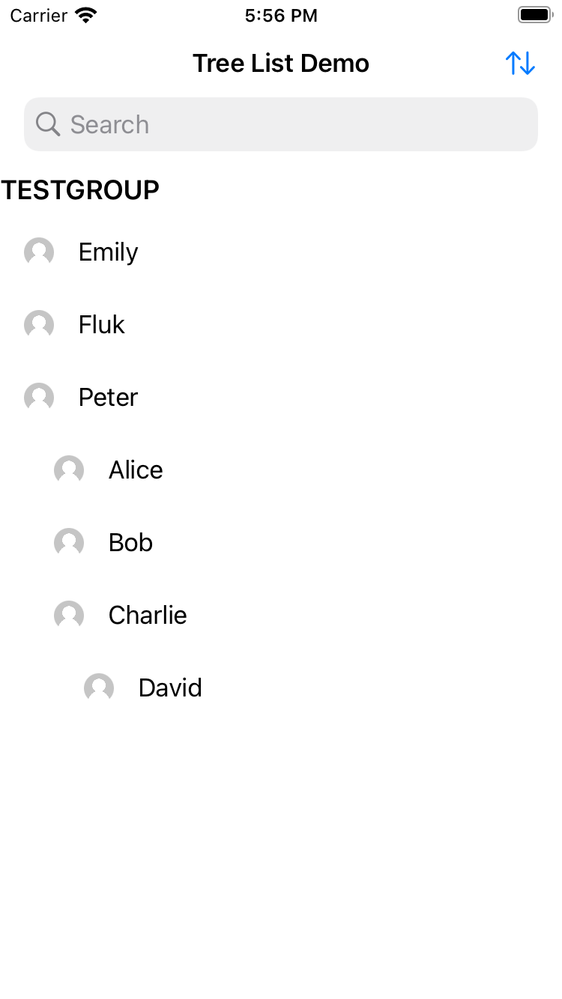

## TreeList ViewController

A treelist viewcontroller that supports insert delete and move line by line.
The sections could be expanded and folded by clicking the header.
You can define how to sort these cells by providing compared fucntions for the protocol. By default, it would sort by first letter in the same layer.

